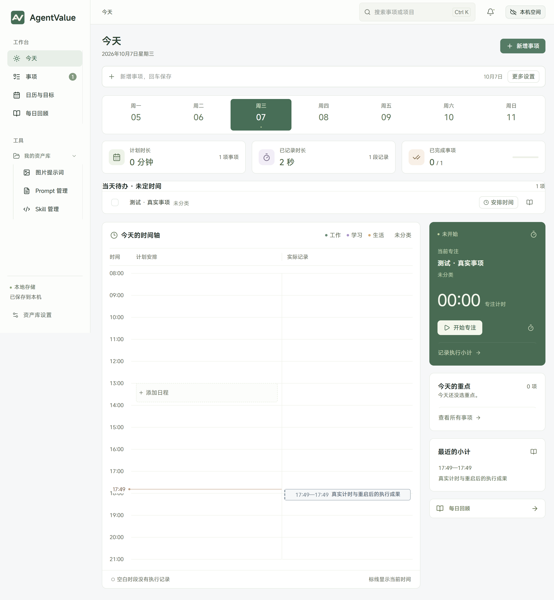
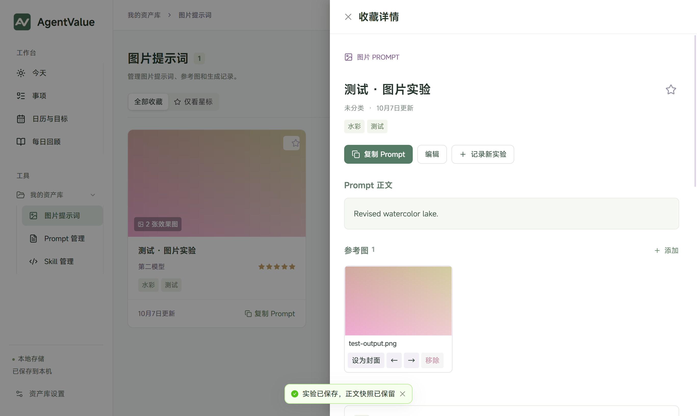
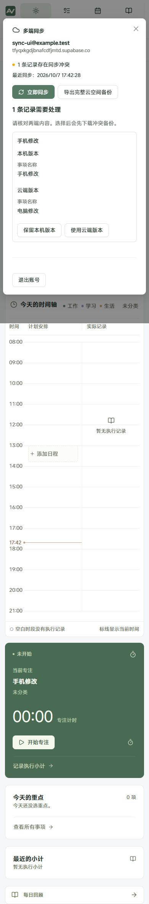

<p align="center"></p>

# AgentValue

在一个软件里安排事项、记录执行、整理回顾，并管理需要用到的 Prompt、图片提示词和 Skill。

[](https://github.com/lizhengda0525-sudo/AgentValue/actions/workflows/windows.yml)

[下载稳定版](https://github.com/lizhengda0525-sudo/AgentValue/releases/latest) · [下载同步测试版](https://github.com/lizhengda0525-sudo/AgentValue/releases/tag/v2.1.0-beta.1) · [使用说明](docs/desktop-guide.md) · [多端同步](docs/supabase-sync.md) · [路线图](docs/roadmap.md)

## 下载与开始使用

| 版本与平台                  | 当前状态                   | 使用方式                                       |
| --------------------------- | -------------------------- | ---------------------------------------------- |
| Windows x64 · V2.0 稳定版   | 已发布，本机数据管理       | 下载安装包，安装后直接使用                     |
| Windows x64 · V2.1.0-beta.1 | 同步测试版                 | 下载安装包；本机空间直接使用，云空间需邮箱账号 |
| 手机网页                    | 已实现，可构建用于同步测试 | 当前提供源码和本机预览，未提供公共网址         |
| 安卓 APK                    | 下一阶段，尚无安装包       | 目标是下载、安装、登录同一账号即可使用         |

Windows 下载 `AgentValue-Setup-<版本>-windows-x64.exe`。安装时可选择位置，无需安装 Node.js 或 Codex。首次启动为空库，可先输入一个事项名称并回车保存。

**需要现有电脑功能时选稳定版；需要试用云同步时手动安装测试版。** 测试版不会推给稳定版的自动更新。新版保留原本机空间，本机记录不会在登录时自动上传。

## 当前功能

| 场景              | 可以做什么                                                           |
| ----------------- | -------------------------------------------------------------------- |
| 安排事项          | 一行快速录入，按需补充日期、小时、项目、优先级、截止时间和重复规则   |
| 查看计划          | 列表、看板、时间线、周小时日程、月历，以及年度和月度目标             |
| 记录执行          | 专注计时、暂停续计，补录和编辑执行小计，计划与实际在时间轴对照       |
| 整理回顾          | 每日回顾、版本快照、周/月汇总；导出 Markdown、CSV 和 ICS 日历文件    |
| 管理 Prompt       | 分类、标签、收藏、搜索；中文变量模板填写后复制，保留原模板           |
| 管理图片提示词    | 参考图与效果图、排序与封面、模型参数、评分和不可变实验正文快照       |
| 管理 Skill        | 本地文件夹和公开 GitHub 导入、文件查看、来源追踪、检查更新与副本导出 |
| 保存与恢复        | 本机完整备份、文件校验、恢复预览及恢复前备份；云空间另有完整备份     |
| 电脑快捷操作      | 托盘、Ctrl+Shift+Space 快速录入、可选系统提醒和软件更新              |
| 多端同步 · 测试版 | 邮箱账号、离线保存、联网同步、附件同步、冲突比较与手动选择           |

事项可关联资产库里的 Prompt 或 Skill。界面使用 Ant Design 组件和本地 MiSans 字体，字体无需外网加载。

## 界面预览

截图来自隔离测试库，内容为测试样例，不会出现在首次安装的个人库中。



<details>
<summary>图片提示词与手机同步冲突处理</summary>





手机截图展示网页测试界面，当前不代表已提供 APK。

</details>

## 多端同步如何使用

1. 安装同步测试版，在右上角“本机空间”中注册或登录邮箱账号。
2. 进入云空间并点击“立即同步”。需要原有数据时，使用“备份并导入本机数据”；导入前备份，原库保留。
3. 其他设备连接同一 Supabase 项目并登录同一账号，日常使用云空间。

云空间先把改动保存到设备，联网时自动同步，通常每 20 秒检查一次。不同事项的修改自动合并；同一记录两端修改时保留两份内容并提示选择。图片和 Skill 文件按账号隔离存放。

本机空间保存到 SQLite；云空间使用设备上的 IndexedDB 和 Supabase。两种空间独立，编辑本机空间不会自动上传。运行中的计时器只属于当前设备，完成后的执行小计会同步。

实际云端登录和读取连接已检查；自动双端测试使用模拟云端，真实设备的双端写入、附件和断网恢复还需验收。安卓 APK 将把页面、字体和图标打包进软件，直接连接 Supabase，目标是无需电脑开机，也无需自行部署网站。

具体配置、备份、限制与验证步骤见 [多端同步说明](docs/supabase-sync.md)。

## 数据与使用边界

- 升级沿用原安装位置与本机数据；卸载保留本机数据目录。详见 [桌面使用说明](docs/desktop-guide.md)。
- GitHub 共享源码和安装包，不共享个人库。数据库、图片、备份、本地配置和账号凭据均不提交。
- 不调用在线图片生成，不自动运行 Skill；外部日历账号同步留待后续。当前支持 ICS 文件交换。
- 本机 GitHub Skill 导入需要 Git；云空间使用公开 GitHub 接口。暂不支持私有仓库。
- 手机网页关闭后不提供定时后台提醒；安卓提醒列入 APK 阶段验证。
- 私有附件暂不自动清理。清除浏览器数据会删除未同步缓存，重要修改请确认同步完成或导出备份。

## 从源码开发

需要 Node.js **24.x**、pnpm **11.19.0**；本机 GitHub 导入需要 Git。

```powershell
git clone https://github.com/lizhengda0525-sudo/AgentValue.git
cd AgentValue
npm install --global pnpm@11.19.0
pnpm install --frozen-lockfile
pnpm launch
```

未配置云端时可使用本机空间。需要云同步时复制 `.env.example` 为 `.env.local`，填入自己的 Supabase 项目地址和 publishable key，执行 [初始化脚本](supabase/migrations/202610070001_sync.sql)，再构建。

```powershell
pnpm test
pnpm format:check
pnpm build
pnpm build:mobile
pnpm test:sync-ui
pnpm test:ui
pnpm package
```

`pnpm dev` 开启前端热更新与本机后端；`pnpm build` 后执行 `pnpm serve`，电脑预览位于 `http://127.0.0.1:5173/`。`pnpm build:mobile` 后执行 `pnpm serve:mobile`，独立网页预览位于 `http://127.0.0.1:5174/`；本机地址不能直接作为手机上的网址。

安装包输出到 `release/`。测试使用隔离目录，证据位于 `artifacts/`；源码仓库不包含个人数据和构建产物。

[协作开发与发布](CONTRIBUTING.md) · [文档索引](docs/README.md) · [版本记录](CHANGELOG.md) · [反馈问题](https://github.com/lizhengda0525-sudo/AgentValue/issues)
