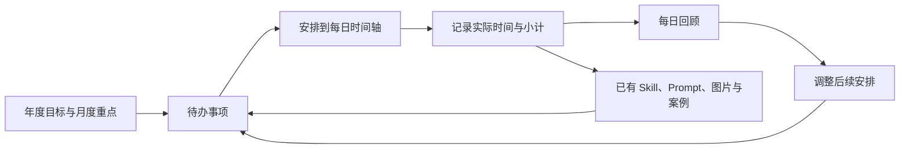

# AgentValue 个人工作生活助手：调研与功能建议

调研日期：2026-10-04（北京时间）。本地基线：AgentValue 0.3.5，提交 `3228be0c5e8ca2632abca2f8534f8884edbcd372`。

本次使用 GitHub 搜索、仓库接口、选定源码及产品官方文档，比较 8 个产品，并检查 1 个日历组件。没有安装或试用这些参考产品，没有做性能或易用性实测。下文“已核查”指官方说明或指定源码；“建议”是针对 AgentValue 的产品判断，不代表已实现。商业产品的权限、套餐和平台差异需在实际接入前再次核对。

## 1. 小小达的核心建议

把 AgentValue 的新方向定为：**个人工作台，把事项、日程、实际记录、回顾和现有 AI 资产放在一起。**

你每天使用时应该形成下面这条路径：

最值得先做好的三件事：

1. **待办能直接放到日历上。** 例如“整理项目报告”先放进事项箱，再安排到明天 09:00—10:30。
2. **计划和实际分开。** 保留原计划，另记实际干了什么、花了多久、有什么结果。
3. **每天能回看，而且不需要重写一遍。** 自动汇集当天的小计、完成项和未完成项，你补充感想并决定明天怎么调整。

现有收藏库可以成为这套工作台的特色：任务里直接挂上需要的 Prompt、Skill、参考图和成功案例，做完后把新的成果留下来。

## 2. AgentValue 现在有什么，新增部分缺什么

本地 [README](../README.md)、[数据类型](../src/types.ts)、[界面](../src/App.tsx) 和 [存储层](../electron/store.cjs) 显示：

- 已有 Skill、文字 Prompt、图片 Prompt、实验记录、搜索标签，以及本地备份恢复。
- 使用 Electron + React + TypeScript + SQLite，适合继续扩展 Windows 本地工作台。
- 当前页面是首页、Skills、文字、图片、设置；数据模型主要围绕 AI 资产。
- 没有工作任务、日历时间段、执行小计、每日回顾的独立数据模型。
- 当前软件退出后不在后台运行；可靠提醒需要单独设计应用运行、托盘、电脑休眠和关机时的行为。

因此可以沿用现有技术栈，但需要新增“个人安排”模块。旧的产品路线图面向资产收藏，本次目标扩大了产品范围；这份报告作为新方向的提案，不能把旧路线里尚未完成的项目当成新功能的前置条件。

## 3. 调研对象和可借鉴的地方

表中功能是本次核查结果；最后一列是小小达的建议。

| 产品 | 已核查的相关能力 | 对 AgentValue 的建议 |
| --- | --- | --- |
| [Super Productivity](https://github.com/super-productivity/super-productivity) | 任务、项目、子任务、日程、预计与实际耗时、工作记录；可接 GitHub 等任务来源；本地使用与同步选项 | **最值得整体参考。** 学习任务和排期、时间记录的连接方式，首版少做外部平台适配 |
| [TimeTagger](https://github.com/almarklein/timetagger) | 交互时间轴、按标签记录耗时、日报表和 CSV/PDF 导出；可本地部署 | **最值得参考执行记录。** 一次任务可以分几段做，每段都有开始、结束和文字说明 |
| [ActivityWatch](https://github.com/ActivityWatch/activitywatch) | 本地自动记录活跃应用、窗口、浏览器活动与离开电脑状态 | 以后可辅助回忆当天活动；应用使用时长不能直接当成任务成果 |
| [Vikunja](https://vikunja.io/help/tasks/) | 项目任务、日期、优先级、标签、评论和附件；列表、看板、甘特图、表格等视图 | 学习事项整理与筛选；首版用列表即可，个人助手暂时不需要完整团队系统 |
| [Sunsama](https://help.sunsama.com/docs/usage-guides/daily-planning/) | 引导式每日计划、预计工作量检查、收工回顾；另有每周目标和回顾 | **最值得参考每日使用流程。** 早上选重点，晚上处理未完成事项并回顾 |
| [TickTick／滴答清单](https://ticktick.com/features) | 任务、年/月/周等日历视图、重复提醒、筛选标签、专注、习惯与快捷录入 | 学习工作与生活放在同一个工具里，增加重复事项、快捷录入和分类 |
| [Todoist](https://www.todoist.com/help/todoist/integrations/use-the-calendar-integration-rCqwLCt3G) | Google/Outlook 日历事件与任务同屏；安排过时间的任务可同步成日历事件 | 学习外部日历与本地任务的区分；同步要明确哪些信息能修改、谁是数据来源 |
| [Akiflow](https://product.akiflow.com/help/articles/3677363-time-blocking-101) | 集中收件箱、任务安排到时间段、一个时间段容纳多个任务、日历占时 | 学习“先收集，再安排”；后续可增加集中处理零碎任务的时间段 |

**参考排序：Super Productivity 的任务结构 + TimeTagger 的记录方式 + Sunsama 的每日流程。** 滴答清单补生活场景，Todoist 与 Akiflow 补外部日历和收件箱思路。这是适配程度判断，没有对这些产品做排名测试。

Vikunja 的 GitHub 地址 `vikunja/vikunja` 本次返回 404。官网当前提供的源码入口是 [code.vikunja.io](https://code.vikunja.io/)；本报告以官网和官方帮助为依据，不把不存在的 GitHub 地址当参考仓库。

### 选定源码进一步说明了什么

- Super Productivity 的 [任务模型](https://github.com/super-productivity/super-productivity/blob/ab46b6a0cf874093be7ea73960b06dac9cee8dbc/src/app/features/tasks/task.model.ts) 区分预计耗时、累计耗时、每天耗时，以及日期和带时间的日期字段。
- 它的 [Planner 文档](https://github.com/super-productivity/super-productivity/blob/ab46b6a0cf874093be7ea73960b06dac9cee8dbc/docs/wiki/4.03-Planner-View.md) 明确区分“安排在哪一天”和“安排到几点”，这正适合待办与日历之间的转换。
- 它的 [时间记录文档](https://github.com/super-productivity/super-productivity/blob/ab46b6a0cf874093be7ea73960b06dac9cee8dbc/docs/wiki/4.14-How-Time-Is-Logged.md) 使用一个当前计时任务；累计和每日耗时有助于统计，但 AgentValue 还应独立保留每个执行时间段的文字小计。
- TimeTagger 的 [记录与统计源码](https://github.com/almarklein/timetagger/blob/6c4f1fc53b8557651e9c32191b3b5b03a4d098b5/timetagger/app/stores.py) 将一条记录保存为开始、结束、描述等字段，并按查询时间范围裁切统计。适合参考跨日记录如何分别计入两天。

这里没有直接复制参考项目代码。

## 4. 对你四项需求的具体反馈

### 4.1 年、月、日计划与小时标记

建议同时提供“目标”和“日历”：

| 层级 | 应该放什么 | 示例 |
| --- | --- | --- |
| 年 | 年度目标、重要日期、阶段节点 | 完成一项长期学习目标；安排年度旅行 |
| 月 | 本月重点、里程碑、月历 | 本月整理完一批资料 |
| 周 | 本周任务分布、时间占用 | 哪几天适合集中工作 |
| 日 | 小时刻度、具体时间段、全天事项 | 09:00—10:30 整理资料 |

年度目标可以关联月度重点和任务。年历负责看重要日期，不能用“有日历格子”代替年度规划。

日视图按小时显示标签，时间段允许按 15/30 分钟安排，也能手动输入准确时间；不用把所有任务强行切成一小时。支持拖动改时间、拉长缩短、显示当前时间线、颜色区分工作/学习/生活，冲突时提示你处理。

**计划日期、截止日期、执行时间要分开。** “周五前交报告”是截止要求；“周三 14:00 写报告”是你选的工作时间。修改工作安排不应改变交付期限。

同一个任务可以安排在不同日期的多个时间段。只知道“这周要做”时，也可以先放进本周清单，不要求立刻填几点。

### 4.2 分时段小计与每日回顾

每个实际时间段都能记：

- 实际开始和结束时间：可手动补录，也可开始/暂停计时。
- 做了什么：例如“完成第一版目录，补齐两张图”。
- 结果或进度：完成、做到一半、受阻，以及成果链接或相关资产。
- 遇到的问题和下一步：都可选填，减少记录负担。

一个任务可以有多条执行记录；临时发生、没有提前规划的事情也能直接补记。暂停后再继续，应产生另一段记录。

每日回顾自动汇集：

1. 当天计划与实际时间，按工作、学习、生活分类。
2. 完成的任务及成果，正在推进但未完成的任务。
3. 当天所有时间段小计。
4. 未完成事项的处理：明天继续、重新排期、返回事项箱或取消。
5. 你写的“今天最有价值的事、卡在哪里、明天重点”。

**自动汇总先用确定的规则完成。** 从记录生成清单、分钟数和计划差异，无需接模型，也无需 API Key。润色成日报、周报时，可以先调用已有 Prompt 模板供你复制使用；以后再接可选择的模型。

生成式 AI 只能基于已经记录的事实写草稿。计划过但没留下执行记录的时段应显示“未记录”，不能猜测它已经完成。

保存每日回顾时保留一份当时的汇总快照。事后补录会提示“记录有更新，可重新汇总”，不悄悄改掉你已写好的回顾。每周和每月可以沿用相同做法。[Sunsama 的周回顾](https://roadmap.sunsama.com/changelog/weekly-review-20) 可作为流程参考。

### 4.3 当前事项安排

建议先做一个简单好用的“事项箱”：

- 常用清单：待整理、今天、本周、以后、已完成。
- 分类：工作、学习、生活，再加项目与标签。
- 状态：待办、进行中、等待、完成、取消。
- 可选字段：优先级、截止日期、预计用时、子任务、备注。
- 操作：快速添加、搜索筛选、拖到日历、批量改分类、从回顾重新排期。

新建时只要求标题。一个尚未想清楚的事项不应该先填十几个字段。

生活安排先用任务和重复规则覆盖：缴费、采购、家务、运动、阅读、纪念日等。习惯热力图、连续打卡和四象限可以后加，先看日常使用是否真的需要。首版支持常见每日/每周/每月规则；中国法定调休需要额外日历数据或手动例外，不能把周一至周五直接当成所有工作日。

### 4.4 同类产品的扩展与同步

“同步”要拆成三件事：

| 类型 | 用户得到什么 | 建议顺序 |
| --- | --- | --- |
| 外部日历接入 | 把会议和个人日程放到同一张时间轴 | 本地流程稳定后优先考虑 |
| 多设备数据同步 | 手机记事项，电脑安排和回顾 | 先确定移动端或网页入口，再做同步 |
| 团队协作 | 分享项目、分配任务、共享进度 | 有明确协作需求后再做 |

外部日历建议逐步增加：

1. 导入/导出 ICS 文件，方便迁移。它是文件交换，不能叫实时同步。
2. 接入最常用的一家日历，只读显示会议和忙闲。
3. 用户主动选择后，把本地计划写到外部日历。
4. 再扩展双向修改、删除、重复事件例外及冲突处理。

Todoist 官方文档说明：外部日历事件在应用内只读；已关联任务的事件可同步部分修改；单次重复事件等仍有限制。说明“有日历集成”并不等于所有东西都能随意双向同步。[官方同步说明](https://www.todoist.com/help/todoist/integrations/use-the-calendar-integration-rCqwLCt3G)

多设备同步应该同步记录及变更，并处理离线修改、删除和冲突。现有整库备份恢复服务于迁移与恢复，不能直接当多设备合并；也不建议让两台运行中的电脑共同写同步盘里的 SQLite 数据库。

## 5. 一天实际用起来是什么样

下表是拟议操作示例，全部是假设数据，不是你的真实日程。

| 原计划 | 实际记录 | 时间段小计 |
| --- | --- | --- |
| 09:00—10:00 整理报告 | 09:10—10:20 | 完成目录和两张图，还缺结论 |
| 10:00—11:00 阅读资料 | 10:30—11:00 | 读完第一节，整理三个疑问 |
| 没有提前安排 | 11:00—11:30 临时沟通 | 确认下周交付范围 |
| 19:00—19:30 运动 | 未记录 | 显示“未记录”，待补充 |

当天可自动计算：以上已记录时长共 **130 分钟**；整理报告原计划 60 分钟，实际 70 分钟。它仍然是“进行中”，花够时间不能自动等于任务完成。

晚上你只需要补一句“报告需要补结论，明早安排 30 分钟”，选好后续时间；年度目标和月度重点也能查看有哪些实际任务在推动它们。

## 6. 页面安排建议

保留现有资产库，新增几个清楚的入口：

| 页面 | 主要内容 |
| --- | --- |
| 今天 | 日期、今天重点、小时日程、当前任务、快速小计、收工回顾 |
| 事项 | 待整理/今天/本周/以后，项目、优先级与筛选 |
| 日历 | 年/月/周/日；轻量年度目标与月度重点 |
| 回顾 | 每日记录、计划与实际比较、历史回顾；以后加周/月汇总 |
| 资产库 | 已有 Skills、文字 Prompt、图片 Prompt 与实验 |
| 设置 | 数据目录、备份、提醒；后续增加日历连接与同步 |

任务详情旁边放“相关资产”，可以直接找到需要的 Prompt 和 Skill。年度目标与月度重点可放在日历侧栏，初期不必再新增两张复杂页面。

首页优先显示今天要做什么和下一个时间段，同时保留访问收藏库的入口。

## 7. 实施顺序与首版范围

以下是建议批次，不是已经承诺的版本号或工期。投入等级只表示相对复杂度。

| 批次 | 交付内容 | 做完后能解决什么 | 投入 |
| --- | --- | --- | --- |
| 第一批：本地安排和回顾 | 事项箱；轻量年度目标/月度重点；年/月/周/日历与小时刻度；手动执行记录和小计；规则式每日汇总；备份覆盖新数据 | 完整覆盖你最先提出的计划、执行、小计、回顾 | 中到大 |
| 第二批：用起来更省事 | 开始/暂停计时、重复事项、提醒与托盘、快捷录入、周/月回顾、关联现有资产、Markdown/CSV 导出 | 减少录入，串起工作生活和收藏内容 | 中到大 |
| 第三批：外部连接 | ICS；一家常用外部日历只读接入；明确选择后的日历写入 | 把外部会议与个人安排放到一起 | 大 |
| 第四批：移动入口与智能辅助 | 手机网页或移动端、多设备同步；AI 回顾草稿与排期建议；可选活动记录导入 | 随时收集事项，并获得辅助建议 | 大，宜拆开实施 |

第一批先使用手动记录，足以完成“这个时间段做了什么”的需求；计时器是便利功能，不是小计的必要前提。可用“新建记录时带入原计划时间，确认或修改后保存”减少输入，但绝不能自动把计划转成实际。

如果缩小到最小可用版本，保留：**事项箱、小时日历、执行小计、每日回顾、可靠备份**。年度和月度先做重点与里程碑录入，再扩展进度图等展示。

首版暂缓复杂团队权限、全平台同步、全天活动采集、自动重排整天日程和独立知识库。它们与第一批相比需要更多接入和维护工作。

## 8. 技术上如何接到现有项目

无需重写桌面框架。建议新增下面几类数据：

| 数据 | 职责 |
| --- | --- |
| 目标与月度重点 | 目标、时间范围、上下级关系、关联任务 |
| 任务 | 要做什么、状态、截止日期、预计时间 |
| 计划时间段 | 准备在哪天几点做什么，一个任务可关联多段 |
| 执行记录 | 实际开始/结束、文字小计、结果；可关联任务和计划，也可独立补录 |
| 每日回顾 | 按本地日期保存个人文字和汇总快照 |
| 资产关联 | 任务/成果关联已有 Prompt、Skill、图片实验，避免重复复制内容 |

日历界面可以先验证 [FullCalendar 的 React 组件](https://fullcalendar.io/docs/react)。其 [TimeGrid](https://fullcalendar.io/docs/timegrid-view) 提供日/周的纵向时间刻度，[Multi-Month](https://fullcalendar.io/docs/multimonth-grid) 支持年历，[editable](https://fullcalendar.io/docs/editable) 支持拖动和改时长。采用 Standard 范围即可先验证需求；**日/周时间格不需要为了“时间轴”这个名字而引入 Premium 的资源 Timeline。** [官方许可证划分](https://fullcalendar.io/license)

实际引入前做一个小型界面验证：中文显示、React 19 适配、键盘操作、拖动和保存失败回退、两类时间段同屏。日历组件只解决显示与交互，任务、执行记录、回顾和同步仍由 AgentValue 管理。

本地源码中还有几处扩展时要同步处理：

- `electron/store.cjs` 当前数据库版本上限是 2；`electron/backup.cjs` 当前接受 Schema 1/2。新表加入后，应一起升级迁移、备份预览、校验、恢复和导出清单，不能只改界面。
- 当前 `state()` 返回全量资产。日程按日期范围查询，任务列表按筛选加载，避免把多年记录全部塞入首页。
- 执行时间存真实时间点；“哪天”按明确的本地时区归属。全天事项用日期，不能硬转成午夜时间点。跨午夜记录按每天交集分钟数统计。
- 最多一个任务计时器运行；计时不靠界面每秒加一维持正确性。电脑休眠、重启或程序异常退出后，保留待核实记录，由你确认有效时间。
- 提醒在应用运行时先做好。若引入托盘，明确“关窗口”和“退出”的区别；电脑关机时不能承诺桌面提醒，重开后合并提示漏掉的事项。

这些是拟议设计要求，本轮没有修改程序或验证运行行为。

## 9. AI 助手应该从哪里开始

可以分三步：

1. **无需 AI 的自动汇总。** 确定地计算耗时、列完成项和整理小计。
2. **已有 Prompt 帮助写回顾。** 将选定的当天记录填进模板，复制到你使用的 AI 工具，结果手动保存。
3. **可选模型接入。** 一键生成日报/周报草稿、拆解事项、提出排期方案。展示依据，允许编辑；排期建议由你选择应用。

值得做的提问例如：“这周哪个目标投入最少？”“报告任务还剩什么？”“明天上午有哪些空档？”它们依赖正确的任务和时间记录，不能靠通用聊天界面替代数据基础。

未来接入活动记录时，ActivityWatch 的窗口与应用信息只能提示“可能在做什么”。离线阅读、运动、家务、沟通都需要你补充或确认。自动采集作为明确开启的辅助项，不默认采集全天。

## 10. 新功能将来应如何验收

以下是未来开发的检查目标，本次没有执行这些测试：

1. 只填标题就能保存事项；重启后仍存在，支持中文查找。
2. 任务可从事项箱安排到 09:00—10:30，拖动后保存；截止日期保持原值。
3. 一项任务分两天、三段执行，原计划与每条实际记录和小计都能回看。
4. 跨午夜 23:30—00:30 的记录，两天各计 30 分钟；全天事项不因时区偏移换日。
5. 无记录的计划显示“未记录”；未完成任务不会因为时间过去就自动完成。
6. 每日回顾能重建来源，修改已保存回顾前保留个人文字；未完成项重新排期后旧日记录仍在。
7. 新库和旧收藏库迁移、整库备份恢复都保留目标、任务、执行记录及原有资产。
8. 以后增加计时/提醒时，验证暂停、睡眠、重启、异常退出、漏提醒与重复提醒。
9. 以后增加同步时，验证断网、两设备同时修改、删除、重复事件改单次、外部解除连接，避免静默覆盖和重复创建。

## 11. 仓库维护与复用情况

本次 GitHub 接口显示以下四个仓库均未归档。时间为接口返回的 UTC 最近推送时间，只说明有代码活动，不代表质量或兼容性已经验证。

| 仓库 | 最近推送（UTC） | 当前识别的许可证 |
| --- | --- | --- |
| [Super Productivity](https://api.github.com/repos/super-productivity/super-productivity) | 2026-10-03 22:00:59 | MIT |
| [TimeTagger](https://api.github.com/repos/almarklein/timetagger) | 2026-09-28 07:50:32 | GPL-3.0 |
| [ActivityWatch](https://api.github.com/repos/ActivityWatch/activitywatch) | 2026-10-01 13:15:53 | MPL-2.0 |
| [FullCalendar](https://api.github.com/repos/fullcalendar/fullcalendar) | 2026-10-03 04:03:18 | Standard 为 MIT；Premium 另有规则 |

仓库许可证不能自动代表其所有子模块或依赖的授权。此处是调研信息；直接引入代码时再核查具体文件和依赖。商业产品用作功能与流程参考。

关键源码已使用固定提交复核：Super Productivity `ab46b6a0cf874093be7ea73960b06dac9cee8dbc`，TimeTagger `6c4f1fc53b8557651e9c32191b3b5b03a4d098b5`。[证据索引](research/personal-assistant-evidence-2026-10-04.json) 保存本轮仓库信息、核查字段、文档入口和调研限制。

## 12. 小小达建议确定的下一步

下一步可围绕第一批范围做一份页面草图和明确需求：**事项箱 + 年月重点 + 小时日历 + 执行小计 + 每日回顾**。先让一天的实际使用连起来，再补计时、生活重复事项、周月回顾与外部连接。

最能体现 AgentValue 特色的后续连接是：**任务告诉你要做什么，日历告诉你何时做，资产库告诉你用什么，回顾告诉你做得怎样。**
